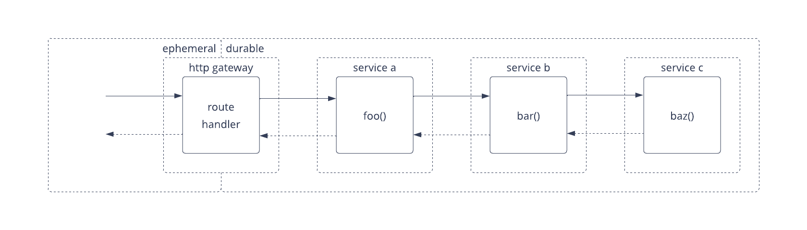
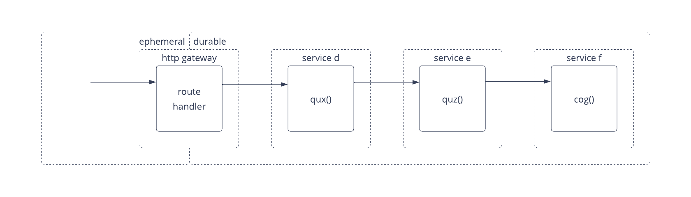
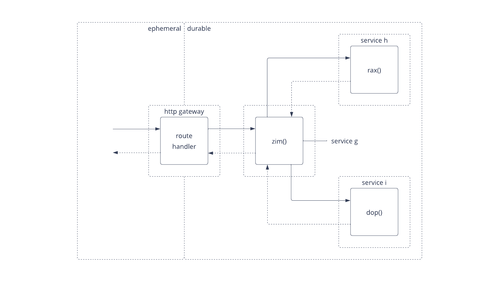

# Async RPC | Resonate example application

This example application showcases Resonate's Async RPC capabilities with three different request flows.

- [Await Chain](#await-chain-request-flow)
- [Detached Chain](#detached-chain-request-flow)
- [Fan-out Workflow](#fan-out-workflow-request-flow)

To learn more about Resonate as an Async RPC, checkout the [Resonate is also an Async RPC Framework](https://resonatehqio.substack.com/p/resonate-is-also-an-async-rpc-framework) article.

## Project prerequisites

This example application uses [uv](https://docs.astral.sh/uv/) as the Python environment and package manager.

After cloning this repo, change directory into the root of the project and run the following command to install dependencies:

```shell
uv sync
```

This example application requires that a [Resonate Server](https://docs.resonatehq.io/get-started/server-quickstart) is running locally.

## Resonate's remote invocations

Resonate offers several APIs to invoke a function that is remote to the calling process.

These APIs can be grouped into two categories:

- Ephemeral to Durable
- Durable

### Ephemeral to Durable

Ephemeral to Durable is when a request flow transitions from a non-durable (ephemeral) flow into a Durable one.

A very practical example of this is an HTTP gateway / server.

The request that comes into the HTTP gateway is ephemeral, that is — if either the caller or callee crashes, the request needs to be made again starting from the beginning without any means of resumption.

But inside the request handler, Resonate is used to invoke the next function in the request flow, which transitions the request flow into a durable one — that is, from that point on the request flow can resume if the process(es), in which the request is progressing, crashes.

Resonate offers two Ephemeral to Durable APIs:

- `resonate.run()` which invokes the function in the same process (execute here).
- `resonate.rpc()` which invokes a function in a remote process (execute over there).

Each of these APIs provides a handle that can be used to get the result of the invocation.

This example application exclusively showcases the `resonate.rpc()` Ephemeral to Durable API.

Within functions that transition from Ephemeral to Durable it is recommended to use `try/except` statements to handle errors.

### Durable

The Durable APIs are the APIs that are available inside the Durable Call Graph.

There are 3 Durable remote invocation APIs that are available on the Context object that is passed into a function invoked via Resonate.

- `context.rfi()` a fully asynchronous remote invocation API which returns a promise that can be awaited on at any point later on. This is showcased in the Fan-Out Workflow example flow.
- `context.rfc()` a syntactical sugar API that blocks and returns the result of the invoked function. This is showcased in the Await Chain example flow.
- `context.detached()` enables the caller to invoke a function and return without waiting on a promise or a result. This is showcased in the Detached Chain example flow.

Within Durable functions you don't need to use `try/except` statements to handle errors because Resonate catches the errors and automatically retries functions that return them.

## Application Node identity

Each Application Node must identify itself to the Resonate Server and each remote invocation must specificy a target.

An Application Node has two identities:

- unique ID: this should be unique to all other application nodes, and enables unicast message passing — that is, messages targeted to this ID will only ever attempted to be sent to this ID.
- group ID: this ID can be shared across several Application Nodes all running the same code. This enables anycast message passing — that is, the first available Application Node in the group will receive the message.

## Crash recovery

This example application is capable of showcasing Resonate's ability to recover a Durable Call Graph after a process crash.
That is — if you were to kill any of the services in the middle of their request flows, when a new service in the same group becomes available, that request flow will recover.

Practically, a 5-10 second sleep should be added to one of the functions in the request flow to give you time to kill the process before it completes.

example:

```python
def baz(_):
    # ...
    yield ctx.sleep(10)
    # ...
```

Currently, the promise ids of the request flows are static — that is, the top-level promise ids of the Call Graph request flows are hard coded into the route handlers.
This means that you can kill the gateway and the cURL request process as well and resend the cURL request to reconnect with the exact same invocation.

## Request flows

The following request flows each showcase a common pattern needed in distributed applications.

### Await Chain request flow

The Await Chain request flow is one where there is a synchronous chain of calls starting from the cURL request sent in the terminal, then through the HTTP gateway, service a, service b, and finally service c.



Resonate is used in the HTTP gateway to transition the request flow from an ephemeral request flow into a durable one.

This request flow is synchronous — that is, the curl request is blocked waiting on the result from the full chain of calls that goes down to `bar()` and propagates back up. The process that made the cURL request prints the result.

#### How to run the Await Chain example

You'll need 5 separate terminal windows (not including the one running the Resonate Server), one for each service and one to make the cURL request to the gateway.

Run the following commands, each in their own terminal:

_Terminal 1_

```shell
uv run gateway
```

_Terminal 2_

```shell
uv run a
```

_Terminal 3_

```shell
uv run b
```

_Terminal 4_

```shell
uv run c
```

_Terminal 5_

Send a cURL request:

```shell
curl -X POST http://127.0.0.1:5000/await-chain
```

### Detached Chain request flow

The Detached Chain is one where each function plays a role, passing off a result to the next function without waiting on the child invocations.



Resonate transitions the request in the route handler from an ephemeral call to a durable one.

However, unlike the Await Chain flow, the each function returns once it has invoked the next function. There is no waiting on the result, and the last function in the chain prints the result.

#### How to run the Detached Chain example

You will need 5 separate terminal windows (not including the one running the Resonate Server), one for each service and one to make the cURL request (assuming you don't already have the gateway running or a process for the cURL request from the previous example).

Run the following commands, each in their own terminal:

_Terminal 1_

```shell
uv run gateway
```

_Terminal 2_

```shell
uv run d
```

_Terminal 3_

```shell
uv run e
```

_Terminal 4_

```shell
uv run f
```

_Terminal 5_

Send the cURL request:

```shell
curl -X POST http://127.0.0.1:5000/detached-chain
```

### Fan-out Workflow request flow

The Fan-out Workflow request is one where multiple functions are invoked from a caller function, and the result of each of the invoked functions is combined inside the caller to produce the result.



Resonate transitions the request from ephemeral to durable at the route handler.

The `zim()` function then acts as a workflow, invoking `rax()` and `dop()` asynchronously, that is — receiving promises at their invocation and awaiting on the results via the promises later on.

The `zim()` function combines the results of the steps and returns it to the caller where the result is printed.

#### How to run the Fan-out Workflow example

You will need 5 separate terminal windows (not including the one running the Resonate Server), one for each service and one to make the cURL request (assuming you don't already have the gateway running or a process for the cURL request from the previous example).

Run the following commands, each in their own terminal:

_Terminal 1_

```shell
uv run gateway
```

_Terminal 2_

```shell
uv run g
```

_Terminal 3_

```shell
uv run h
```

_Terminal 4_

```shell
uv run i
```

_Terminal 5_

```shell
uv run h
```

Example cURL request:

```shell
curl -X POST http://127.0.0.1:5000/fan-out-workflow
```
